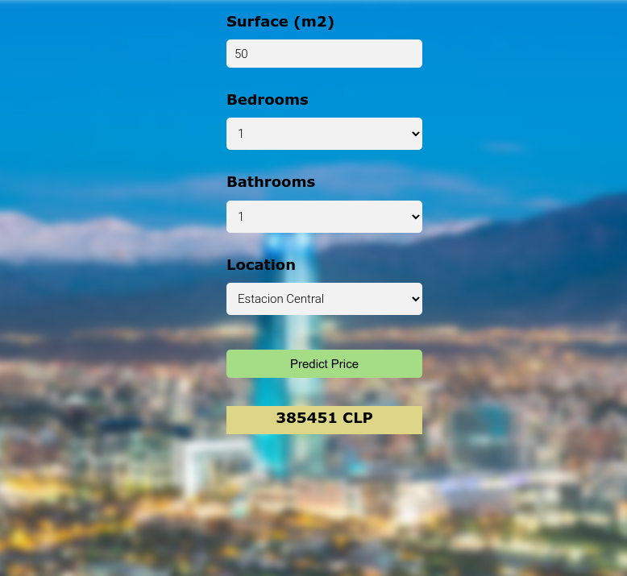

# Predicting Apartment Rent Prices in Santiago Metropolitan Region, Chile

This data science project showcases a real estate price prediction study in Santiago Metropolitan Region of Chile. 
A Web Application displays the rent price of apartments, which are predicted by a machine learning model. 

The apartment listings were collected from https://www.portalinmobiliario.com/ 
and stored into a raw dataset in the file `model/RENT_APARTMENT_RM_raw.csv`. 

This raw dataset was transformed through several stages of analysis, which are reported in several
jupyter notebooks located in the directory `model/`.
The first stages in this workflow were [**Cleaning**](model/1_Santiago_MR_Rent_Apartment_Cleaning.ipynb) the dataset 
and performing an [**Exploratory Data Analysis (EDA)**](model/2_Santiago_MR_Rent_Apartment_EDA.ipynb) 
in order to get familiar with the data, handle NaN values, dealing with outliers and selecting the features which will be used 
for building a predictive model.
The next stage involved conducting [**Feature Engineering**](model/3_Santiago_MR_Rent_Apartment_Feature_Engineering.ipynb) 
where feature transformations were implemented in a preprocessing pipeline that was applied to the training and test sets 
extracted from original dataset.
Next, in the [**Model Building**](model/4_Santiago_MR_Rent_Apartment_Model_Building.ipynb) stage, various type of models, 
based on different algorithms, were trained to predict apartment rent prices, in a supervised regression learning task.
For each model type, the training was carried out applying a 5-fold cross validation on the training set, and performing 
hyperparameter optimization using **Optuna**.
Here the parameters of each model type, as well as all possible set of predictor features in the training set, were considered as 
hyperparameters to be optimized.
The following algorithms were used for model training:

- **Multiple Regression**
- **LGBM Regressor**
- **XGBoost Regressor**
- **CatBoost Regressor**

The best-performing trained models for each algorithm were then used to make predictions on the test set. 
The models that performed best on this evaluation (`model_xgb_f15_t436.pkl` and 
`model_xgb_f15_t474.pkl` in the directory `app/server/artifacts/`) were then used in a final notebook to conduct a 
geospatial comparison of their [**Model Predictions**](model/5_Santiago_MR_Rent_Apartment_Model_Prediction.ipynb) 
made on the training and test sets.
Similar data distributions can be visualized as the different layers in a QGIS project 
stored in `qgis/home-prices-santiago-mr.qgz`.

However, due to memory limitations on the cloud provider, another of the best-performing trained models 
(`app/server/artifacts/model_xgb_f15_t397.pkl`), which is significantly lighter but has only slightly lower 
predictive power, will be deployed in our Web Application for demonstrative purpose.


## Building Web Application for predicting rent prices

The Web Application makes use of the selected model(s) to make predictions of the rent price of 
apartments in the Santiago Metropolitan Region (in Chilean pesos or CLP) and displays this information to the user.
Predicted rent prices are calculated based on the following fields which describe the desired apartment 
and need to be entered by the user: 
Apartment Surface (in square meters), Number of Bedrooms, Number of Bathrooms and Location (city).
The figure below displays the Web Application layout and the predicted rent price of an apartment 
with 50 square meters, 1 bedroom, 1 bathroom, which is located in Estación Central.

The Web Application (see directory `app/`) is built in **JavaScript**, **HTML**, **CSS** and **Python**, using **Flask** 
as a web framework for development.
To overcome the intrinsic limitations of the **Flask's** built-in server, **Nginx** is used in deployment as 
a reverse proxy server to handle the http requests.



## Deploying Web Application to AWS Cloud (ECR, ECS, EC2)

### Containerizing Web Application:

We will deploy our Web Application to the **Amazon Web Services (AWS) Cloud**.
For this, we first build a docker image of our Web Application, based on the intructions 
contained in the Dockerfile stored in the `deploy` directory of our git repository.

```
docker build -t home-prices-santiago-mr:1.0 -f deploy/Dockerfile .
```

If the image was created, it should appear in the listed shown after running:

```
docker images
```

We can now create the **Docker** container associated to our image by running:

```
docker run --network="host" -d home-prices-santiago-mr:1.0
```

Here we added the "host" network option so that the the host (our local machine) network is 
accessible to the container.
If the container was correctly initialized, the **Flask** server should be also running,
which we can check from the container logs:

```
docker logs <container_id>
```

And we should be able to see our Web Application by openning a browser at the at http://127.0.0.1 
or its alias http://localhost.

### Pushing Docker image to AWS ECR:

Once we checked that our Web Application can be accessed from our local machine, we can start deploying it to AWS. 

In order to be able to push our **Docker** image to **AWS ECR (Elastic Container Registry)**, we need 
to authenticate the **Docker** CLI to our default registry, so that **Docker** can push and pull images with **AWS ECR**.
We do this as described in the **AWS** documentation (https://docs.aws.amazon.com/AmazonECR/latest/userguide/getting-started-cli.html):

```
aws ecr get-login-password --region <region> | docker login --username AWS \
    --password-stdin <aws_account_id>.dkr.ecr.<region>.amazonaws.com
```

Next, we create a repository in **AWS ECR**:

```
aws ecr create-repository --repository-name home-prices-santiago-mr --region <region>
```

In order to push our **Docker** image, we need to tag the image that will be pushed to our **ECR** repository.

```
docker tag home-prices-santiago-mr:1.0 <aws_account_id>.dkr.ecr.<region>.amazonaws.com/home-prices-santiago-mr:latest
```

Finally, we push the **Docker** image to **ECR**:

```
docker push <aws_account_id>.dkr.ecr.<region>.amazonaws.com/home-prices-santiago-mr:latest
```

### Deploying Docker container to AWS EC2, ECS:

Now, we will make use of the **AWS Command Line Interface** (CLI) tool to deploy the **Docker** image stored in **ECR** 
to a **EC2 (Elastic Compute Cloud)** instance in a **ECS (Elastic Container Service)** cluster.
First we need to create a security group that includes the traffic rules that we will allow for the **EC2** instance in 
our **ECS** cluster.

```
aws ec2 create-security-group --group-name hpsantiagomr-sg --description "security group for home-prices-santiago-mr"

aws ec2 authorize-security-group-ingress --group-id <security_group_id> --protocol tcp --port 22 --cidr 0.0.0.0/0

aws ec2 authorize-security-group-ingress --group-id <security_group_id> --protocol tcp --port 80 --cidr 0.0.0.0/0

aws ec2 authorize-security-group-ingress --group-id <security_group_id> --protocol tcp --port 443 --cidr 0.0.0.0/0

```

Then we configure the **AWS ECS** CLI, by creating an **ECS** cluster and profile configurations as follows
(see documentation: https://docs.aws.amazon.com/AmazonECS/latest/developerguide/ecs-cli-tutorial-ec2.html).

```
ecs-cli configure \
    --cluster hpsantiagomr-cluster \
    --default-launch-type EC2 \
    --config-name hpsantiagomr-cluster-config \
    --region <region>
```

```
ecs-cli configure profile \
    --profile-name hpsantiagomr-cluster-config-profile \
    --access-key <aws_access_key_id> \
    --secret-key <aws_secret_access_key>
```

Once the configuration steps are done, we create the **ECS** cluster using the configurations defined above.

```
ecs-cli up \
    --capability-iam \
    --keypair <keypair_name> \
    --size 1 \
    --instance-type t2.micro \
    --cluster-config hpsantiagomr-cluster-config \
    --ecs-profile hpsantiagomr-cluster-config-profile \
    --security-group <security_group_ids> \
    --vpc <vpc_id> \
    --subnets <subnet_1_id,subnet_2_id> \
    --verbose
```

Here `<vpc_id>` can be obtained from the command: `aws ec2 describe-security-groups --group-id <security_group_id>`.
While `<subnet_1_id,subnet_2_id>` are the ids of two existent subnets associated to `<vpc_id>` found from the command:
`aws ec2 describe-subnets --filters "Name=vpc-id,Values=<vpc_id>"` 

After a few minutes, we should have the **EC2** instance in our **ECS** cluster up and running, and we can deploy 
our **Docker** container into it.
We can define this deployment as a registered task, which we then run and use to create a service that allows
to maintain the defined task running.
The following commands perform these deployment steps:

```
aws ecs register-task-definition \
    --cli-input-json file://<path>/home-prices-santiago-mr/deploy/aws_ecs_task_definition.json

aws ecs run-task \
    --cli-input-json file://<path>/home-prices-santiago-mr/deploy/aws_ecs_task_run.json

aws ecs create-service \
    --cli-input-json file://<path>/home-prices-santiago-mr/deploy/aws_ecs_service.json
```

From the **AWS Console**, we should now be able to see that the defined task and service are running.
Alternatively, we can run the following commands to obtain the same information:

```
aws ecs list-tasks --cluster hpsantiagomr-cluster
aws ecs list-services --cluster hpsantiagomr-cluster
```

If we want to examine the status of our deployed docker container, we can log into the **EC2** instance 
and run any `docker` command, such as `docker ps`, as explained the **AWS** documentation 
(https://docs.aws.amazon.com/AWSEC2/latest/UserGuide/AccessingInstancesLinux.html).

```
ssh -i <path_to_key_pair.pem> instance_user_name@instance_public_dns_name
```

After confirming it, we will be able to inspect our Web Application by openning a browser under the 
Public DNS address provided for our **EC2** instance.

In this case, the Web Application is temporally accessible under the following URL:
http://ec2-3-139-238-137.us-east-2.compute.amazonaws.com/
